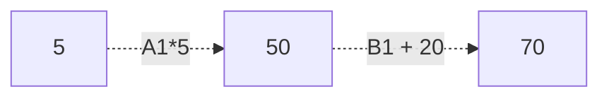

# Einstieg in Rx.NET

Reaktive Programmierung mit .NET

---

## Starke Inspiration dieser Präsentation

[Gregor Biswanger - Einstieg in Rx.NET - Die reaktive Programmierung mit .NET - YouTube](https://www.youtube.com/watch?v=0Y673IoWqUg)

---

## Table of Content
1. [[#Überblick|Überblick]]
	1. [[#Überblick#Asynchrone Programmierung ist schwierig|Asynchrone Programmierung ist schwierig]]
1. [[#Rx Anatomie|Rx Anatomie]]
1. [[#Programmierung mit Rx.NET|Programmierung mit Rx.NET]]
1. [[#Marble-Diagram|Marble-Diagram]]
1. [[#Operators|Operators]]
1. [[#Hot or Cold|Hot or Cold]]
1. [[#Subjects|Subjects]]


---

## Überblick

---

### Asynchrone Programmierung ist schwierig

---

"**R**eactive E**x**tensions ist eine Bibliothek um asynchrone und event-basierte Anwendungen mit Hilfe von Observables und LINQ-Style Operators"

Source: https://github.com/dotnet/reactive

---

### Übersetzung

"Reactive Extensions ist eine Bibliothek mit der man auf Änderungen in Datenströmen reagieren kann."

---

"Die Reactive Extensions erleichtern uns die asynchrone Programmierung beim arbeiten mit Datenströmen."

---

### Interaktive Programmierung

Nach jeder Aktion wird geprüft ob sich die Daten geändert haben oder neue vorhanden sind.

---

### Reaktive Programmierung

Durch Abonierung der Datenquelle bekommen wir automatisch mit, wenn eine Änderung der Daten statt findet.

---

Dieses Prinzip ist in C# durch das Observer-Entwurfsmuster und Events implementiert.

---

### Reactive Extensions

Die Eventdaten werden zu einem Datenstrom, den wir mit "Extensions" manipulieren können.

---

### Reactivity am Beispiel Excel



Ändert man den Wert in einer Zelle, dann ändert sich auch der Wert in der Summenzelle.

---

Die Zelle (Unser Observable), deren Wert geändert wurde, löst ein Event aus, den die Summenzelle (Unser Observer) empfängt und dann den Wert neu berechnet.

---

### Wikipedia-Definition

"Bei der Datenverarbeitung ist Reaktive Programmierung ein Programmierparadigma, das sich an **Datenflüssen** orientiert."

---

### Einfaches Beispiel

```c#
int a = 2;
int b = 3;
int c = a + b;
Console.WriteLine($"before: the value of c is {c}");

a = 7;
b = 2;
Console.WriteLine($"after: the value of c is {c}");
```

```shell
before: the value of c is 5
after: the value of c is 5
```

> [!NOTE] Wir bemerken...
> c reagiert **nicht** auf die Veränderung von a oder b! 


---

### Einfaches Beispiel

```c#
int a = 2;
int b = 3;
int c $= a + b;
Console.WriteLine($"before: the value of c is {c}");

a = 7;
b = 2;
Console.WriteLine($"after: the value of c is {c}");
```

```shell
before: the value of c is 5
after: the value of c is 9
```

> [!TIP] Mit eigenem Operator...
> c **reagiert**  auf die Veränderung von a und b! 

---

### Reactive Extensions

![[Blank diagram.png|700]]

---

### Simpler Doppeklick (Imperativ)
![[Pasted image 20220821185043.png|700]]

---

### Das gleiche mit Rx.NET

![[Pasted image 20220821185107.png|700]]

---

[ReactiveX](https://reactivex.io/)
![[Pasted image 20220821185704.png]]

---

## Rx Anatomie

---

### Observables

Ein **Observable** ist eine Collection von Werten über Zeit.

---

Observable von Außen

![[Pasted image 20220821192242.png|700]]

---

Observables von Innen

![[Pasted image 20220821192555.png| 700]]

---

Ein **Observer** ist der Konsument von Werten, die das **Observable** liefert.

---

### IEnumerator vs IObserver

#### Pull
```c#
public interface IEnumerator<out T> : IDisposable
{
          T Current { get; }
          bool MoveNext();
          void Reset();
}
```
#### Push
```c#
public interface IObserver<in T>
{
    void OnCompleted();
    void OnError(Exception error);
    void OnNext(T value);
}
```

---

### Oberserver Implementieren

Zustände:

- OnNext()
	- Neue Daten hinzugekommen.
- OnError()
	- Es ist ein Fehler aufgetreten.
- OnComplete()
	- Alle Daten sind vorhanden. Abo wird beendet.

---

![[Pasted image 20220821193748.png|700]]

---

### Observable stoppen

- Aufruf von `subscription.Dispose()`
- Durch einen Operator
- Eine Exception wird ausgelöst
- Auslösung von `OnComplete()`

---

## Programmierung mit Rx.NET

---

## Marble-Diagram

![[Pasted image 20220821212521.png]]

---

## Operators

---

## Hot or Cold

---

## Subjects


---

## Additional Links

[Datenstrom – Wikipedia](https://de.wikipedia.org/wiki/Datenstrom)
